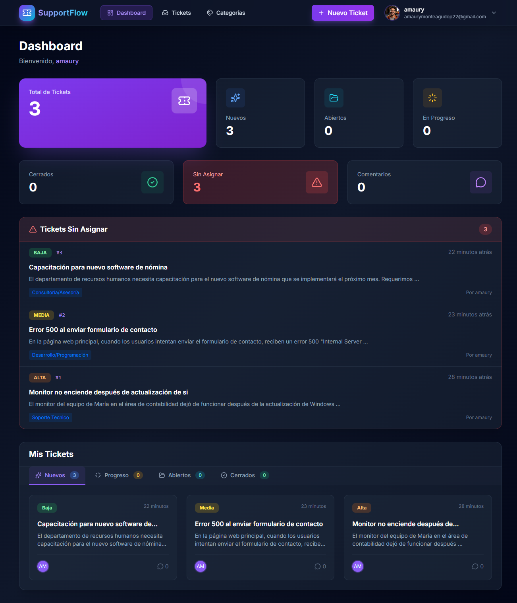
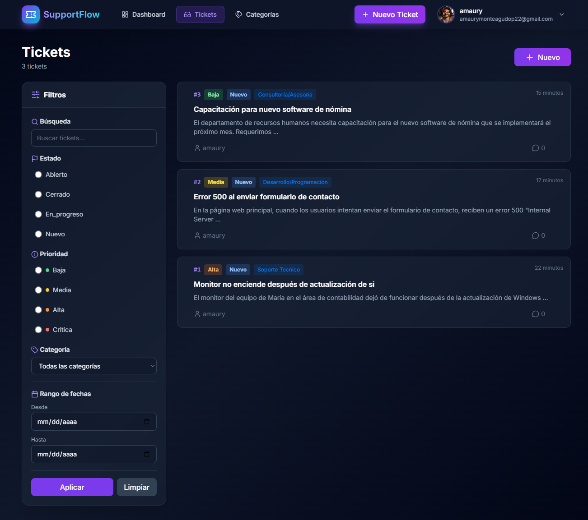
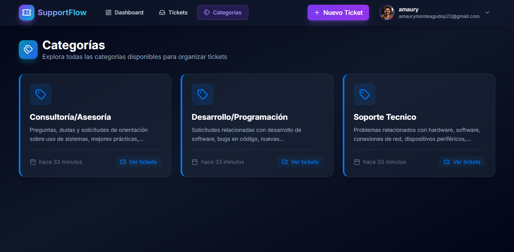
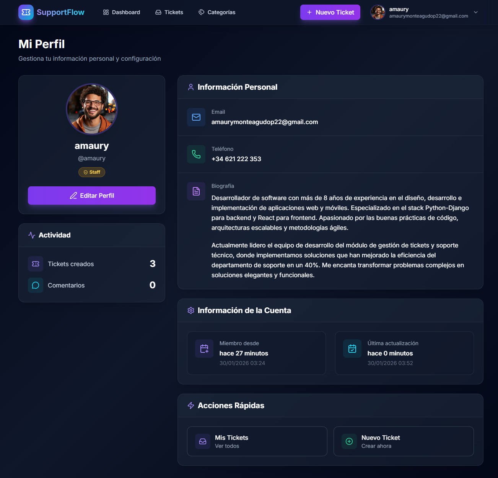

# SupportFlow

**Sistema de gestión de tickets de soporte con roles, filtros avanzados y notificaciones automáticas**

[](https://www.djangoproject.com/)
[](https://www.python.org/)
[](https://www.postgresql.org/)

🔗 **[Demo en vivo](https://web-production-ee2b0.up.railway.app)**

---

## 📸 Screenshots

<p align="center">
  
  
</p>
<p align="center">
  
  
</p>

---

## 🎯 ¿Qué problema resuelve?

Los equipos de soporte necesitan un sistema simple para gestionar tickets sin pagar $30-50/mes por usuario en plataformas como Zendesk o Freshdesk.

**SupportFlow** ofrece:
- ✅ Gestión completa de tickets con estados y prioridades
- ✅ Sistema de roles (Admin vs Usuario)
- ✅ Filtros avanzados y búsqueda inteligente
- ✅ Notificaciones por email automáticas
- ✅ Comentarios en tiempo real
- ✅ Sistema de categorías personalizable
- ✅ 100% gratuito y open source

**Ideal para:** Equipos de soporte pequeños/medianos (5-50 usuarios) que necesitan un helpdesk funcional sin costos recurrentes.

---

## ⚡ Features principales

**Para usuarios:**
- Crear tickets con descripción, categoría y prioridad
- Ver solo sus propios tickets
- Comentar en tickets para seguimiento
- Recibir emails cuando su ticket cambia de estado o es asignado

**Para administradores:**
- Ver todos los tickets del sistema
- Asignar tickets a miembros del equipo
- Cambiar estados (Abierto, En progreso, Cerrado)
- Gestionar categorías desde el panel admin
- Filtrar por estado, categoría, asignado, fecha

**Sistema de notificaciones:**
- Email al crear ticket (notifica a admins)
- Email al asignar ticket (notifica al asignado)
- Email al cambiar estado (notifica al creador)

---

## 🛠️ Stack tecnológico

- **Backend:** Python 3.10+ | Django 5.2
- **Base de datos:** PostgreSQL (producción) | SQLite (desarrollo)
- **Frontend:** HTML5, CSS3, JavaScript, Bootstrap 5, Lucide Icons
- **Arquitectura:** Class-Based Views (CBV)
- **Deployment:** Railway | Gunicorn
- **Email:** SMTP con Gmail

---

## 🚀 Instalación local

### Requisitos
- Python 3.10+
- PostgreSQL 12+ (o SQLite para pruebas rápidas)

### Setup

```bash
# Clonar repositorio
git clone https://github.com/TuUsuario/SupportFlow.git
cd SupportFlow

# Crear entorno virtual
python -m venv venv
source venv/bin/activate  # Windows: venv\Scripts\activate

# Instalar dependencias
pip install -r requirements.txt

# Configurar variables de entorno
cp .env.example .env
# Edita .env con tus datos (DB, email, SECRET_KEY)

# Migraciones y superusuario
python manage.py migrate
python manage.py createsuperuser

# Ejecutar servidor
python manage.py runserver
```

Abre http://127.0.0.1:8000

**Nota:** Solo admins pueden crear categorías desde `/admin`. Los usuarios las seleccionan al crear tickets.

---

## 📚 Estructura del proyecto

```
SupportFlow/
├── supportFlow/       # Configuración Django
├── ticket/            # App principal (models, views, forms)
├── accounts/          # Autenticación y perfiles
├── templates/         # HTML templates
├── static/            # CSS, JS, imágenes
├── screenshots/       # Capturas para README
├── requirements.txt   # Dependencias
└── .env.example       # Plantilla de variables
```

---

## 🔐 Roles y permisos

| Acción | Usuario | Admin |
|--------|---------|-------|
| Crear ticket | ✅ | ✅ |
| Ver propios tickets | ✅ | ✅ |
| Ver todos los tickets | ❌ | ✅ |
| Asignar tickets | ❌ | ✅ |
| Cambiar estado | ❌ | ✅ |
| Crear categorías | ❌ | ✅ (solo en /admin) |
| Comentar | ✅ | ✅ |

---

## 🧪 Funcionalidades técnicas destacadas

- **Filtros avanzados:** Por estado, categoría, asignado, búsqueda de texto
- **Paginación:** 10 tickets por página para mejor performance
- **Optimización de queries:** Uso de `select_related` para evitar N+1 queries
- **Seguridad:** Control de permisos estricto, usuarios solo ven sus datos
- **UI moderna:** Diseño responsive con Tailwind-like utility classes

---

## 🤝 Sobre este proyecto

Proyecto de portfolio personal para demostrar habilidades en:

✓ Class-Based Views (ListView, CreateView, UpdateView, DetailView)  
✓ Sistema de permisos personalizado  
✓ Filtros y paginación en Django  
✓ Integración de email con SMTP  
✓ Deployment en producción con PostgreSQL  

**Feedback y sugerencias son bienvenidos** → [Abrir issue](https://github.com/TuUsuario/SupportFlow/issues)

---

## 📬 Contacto

**Amaury Monteagudo** — Backend Developer

Especializado en Python, Django, APIs REST y bases de datos.

📧 amaurymonteagudop22@gmail.com  
🔗 [GitHub](https://github.com/MauRyze22) | [LinkedIn](https://www.linkedin.com/in/amaury-monteagudo-40375b3a5)

---

## 📄 Licencia

[MIT License](LICENSE) — Uso libre con atribución.

---

⭐ **Si este proyecto te fue útil, considera darle una estrella — ¡gracias!**
