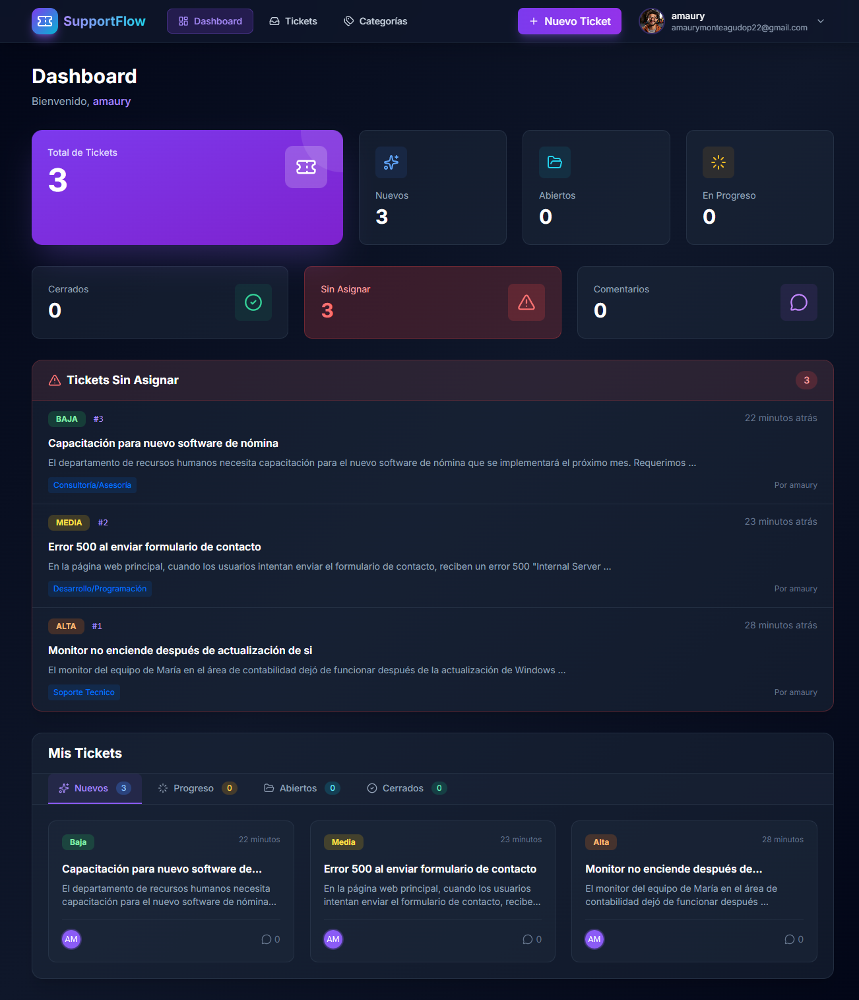
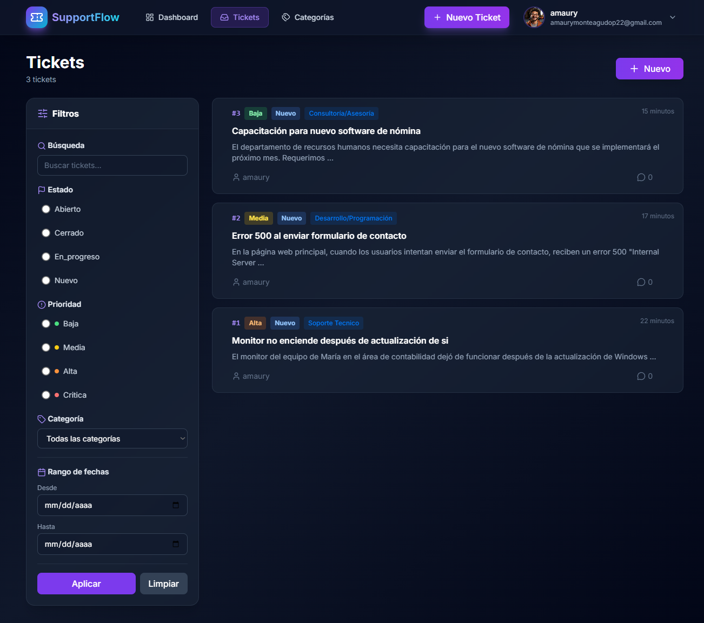
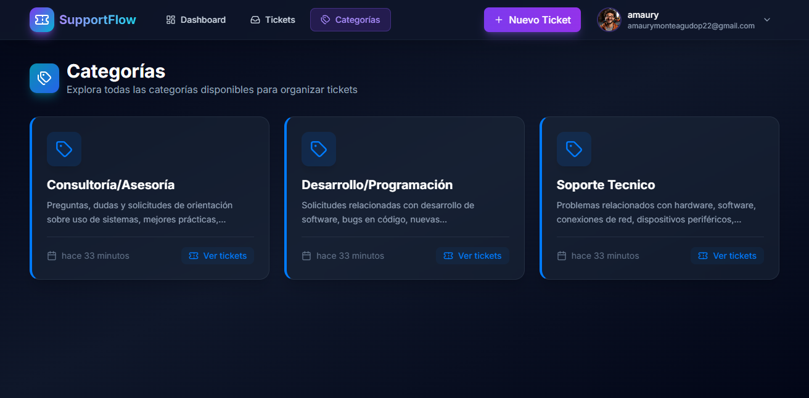
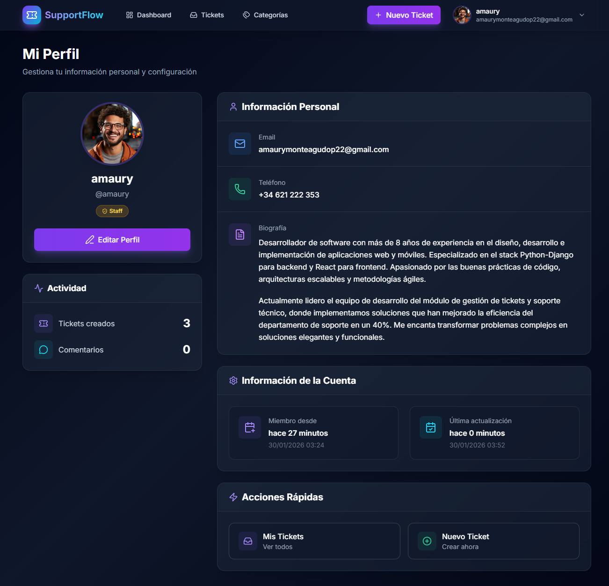

# SupportFlow

**Sistema de gestión de tickets de soporte con roles, filtros avanzados y notificaciones asíncronas**

[](https://www.djangoproject.com/)
[](https://www.python.org/)
[](https://www.postgresql.org/)
[](https://docs.celeryq.dev/)
[](https://redis.io/)

🔗 **[Demo en vivo](https://supportflow-2mqx.onrender.com)**

---

## 📸 Screenshots

<p align="center">
  
  
</p>
<p align="center">
  
  
</p>

---

## 🎯 ¿Qué problema resuelve?

Los equipos de soporte necesitan un sistema simple para gestionar tickets sin pagar $30-50/mes por usuario en plataformas como Zendesk o Freshdesk.

**SupportFlow** ofrece:
- ✅ Gestión completa de tickets con estados y prioridades
- ✅ Sistema de roles (Admin vs Usuario)
- ✅ Filtros avanzados y búsqueda inteligente
- ✅ Notificaciones por email asíncronas con Celery + Redis
- ✅ Comentarios en tiempo real
- ✅ Sistema de categorías personalizable
- ✅ 100% gratuito y open source

**Ideal para:** Equipos de soporte pequeños/medianos (5-50 usuarios) que necesitan un helpdesk funcional sin costos recurrentes.

---

## ⚡ Features principales

**Para usuarios:**
- Crear tickets con descripción, categoría y prioridad
- Ver solo sus propios tickets
- Comentar en tickets para seguimiento
- Recibir emails cuando su ticket cambia de estado o es asignado

**Para administradores:**
- Ver todos los tickets del sistema
- Asignar tickets a miembros del equipo
- Cambiar estados (Abierto, En progreso, Cerrado)
- Gestionar categorías desde el panel admin
- Filtrar por estado, categoría, asignado, fecha

**Sistema de notificaciones asíncronas:**
- Email al crear ticket (notifica a admins) — procesado en segundo plano
- Email al asignar ticket (notifica al asignado) — sin bloquear al usuario
- Email al cambiar estado (notifica al creador) — via Celery + Redis

---

## 🛠️ Stack tecnológico

- **Backend:** Python 3.12 | Django 6.0
- **Base de datos:** PostgreSQL (producción) | SQLite (desarrollo)
- **Frontend:** HTML5, CSS3, JavaScript, Bootstrap 5, Lucide Icons
- **Arquitectura:** Class-Based Views (CBV)
- **Tareas asíncronas:** Celery + Redis
- **Email:** Resend API
- **Archivos estáticos:** Whitenoise
- **Deployment:** Render | Gunicorn

---

## 🚀 Instalación local

### Requisitos
- Python 3.12+
- Redis (via Docker recomendado)

### Setup

```bash
# Clonar repositorio
git clone https://github.com/MauRyze22/supportFlow.git
cd supportFlow

# Crear entorno virtual
python -m venv venv
source venv/bin/activate  # Windows: venv\Scripts\activate

# Instalar dependencias
pip install -r requirements.txt

# Configurar variables de entorno
cp .env.example .env
# Edita .env con tus datos

# Migraciones y superusuario
python manage.py migrate
python manage.py createsuperuser

# Levantar Redis con Docker
docker run -d -p 6379:6379 --name redis-supportflow redis:alpine

# Terminal 1 — Ejecutar servidor
python manage.py runserver

# Terminal 2 — Ejecutar worker de Celery (Windows)
celery -A supportFlow worker --loglevel=info --pool=solo

# Terminal 2 — Ejecutar worker de Celery (Linux/Mac)
celery -A supportFlow worker --loglevel=info
```

Abre http://127.0.0.1:8000

**Nota:** Solo admins pueden crear categorías desde `/admin`. Los usuarios las seleccionan al crear tickets.

---

## 📚 Estructura del proyecto

```
supportFlow/
├── supportFlow/       # Configuración Django + Celery
│   ├── settings.py
│   ├── celery.py      # Configuración de Celery
│   └── urls.py
├── ticket/            # App principal
│   ├── models.py
│   ├── views.py
│   ├── forms.py
│   ├── signals.py     # Dispara tareas asíncronas
│   └── tasks.py       # Tareas Celery (envío de emails)
├── accounts/          # Autenticación y perfiles
├── templates/         # HTML templates
├── static/            # CSS, JS, imágenes
├── screenshots/       # Capturas para README
├── requirements.txt
└── .env.example
```

---

## 🔐 Roles y permisos

| Acción | Usuario | Admin |
|--------|---------|-------|
| Crear ticket | ✅ | ✅ |
| Ver propios tickets | ✅ | ✅ |
| Ver todos los tickets | ❌ | ✅ |
| Asignar tickets | ❌ | ✅ |
| Cambiar estado | ❌ | ✅ |
| Crear categorías | ❌ | ✅ (solo en /admin) |
| Comentar | ✅ | ✅ |

---

## ⚙️ Arquitectura de notificaciones

```
Usuario crea/actualiza ticket
           ↓
Signal detecta el evento
           ↓
Signal llama tarea con .delay()
           ↓
Celery manda tarea a Redis (cola)  ← respuesta inmediata al usuario
           ↓
Worker procesa la tarea en segundo plano
           ↓
Email enviado via Resend API
```

---

## 🧪 Funcionalidades técnicas destacadas

- **Tareas asíncronas:** Celery + Redis para emails sin bloquear al usuario
- **Filtros avanzados:** Por estado, categoría, asignado, búsqueda de texto
- **Paginación:** 10 tickets por página para mejor performance
- **Optimización de queries:** Uso de `select_related` para evitar N+1 queries
- **Seguridad:** Control de permisos estricto, usuarios solo ven sus datos
- **Manejo de errores:** Fallos de email no interrumpen el flujo principal

---

## 🤝 Sobre este proyecto

Proyecto de portfolio personal para demostrar habilidades en:

✓ Class-Based Views (ListView, CreateView, UpdateView, DetailView)
✓ Sistema de permisos personalizado
✓ Filtros y paginación en Django
✓ Tareas asíncronas con Celery + Redis
✓ Integración de email con Resend API
✓ Signals de Django para eventos del modelo
✓ Deployment en producción con Render + PostgreSQL

**Feedback y sugerencias son bienvenidos** → [Abrir issue](https://github.com/MauRyze22/supportFlow/issues)

---

## 📬 Contacto

**Amaury Monteagudo** — Backend Developer

Especializado en Python, Django, APIs REST y bases de datos.

📧 amaurymonteagudop22@gmail.com
🔗 [GitHub](https://github.com/MauRyze22) | [LinkedIn](https://www.linkedin.com/in/amaury-monteagudo-40375b3a5)

---

## 📄 Licencia

[MIT License](LICENSE) — Uso libre con atribución.

---

⭐ **Si este proyecto te fue útil, considera darle una estrella — ¡gracias!**